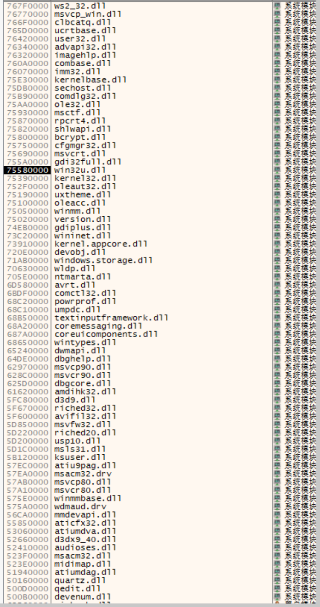

# 九十九の奏～欠け月の夜想曲～ AI翻译补丁

这是SkyFish社九十九の奏～欠け月の夜想曲的AI翻译补丁，使用Claude-3-haiku进行翻译。

本补丁仅供交流学习，请在购买游戏正版的基础上使用本补丁。

## 游戏信息

摘自Getchu

|       ブランド： | [SkyFish](http://www.sky-fish.jp/ "このブランドの公式サイトを開く")[（このブランドの作品一覧）](https://www.getchu.com/php/search.phtml?search_brand_id=25375)                                                                                                    |
| ---------------: | -------------------------------------------------------------------------------------------------------------------------------------------------------------------------------------------------------------------------------------------------------- |
|           定価： | ￥8,800 (税込￥9,680)                                                                                                                                                                                                                                    |
|         発売日： | [2012/09/28](https://www.getchu.com/php/search.phtml?start_date=2012/09/28&end_date=2012/09/28&genre=pc_soft "同じ発売日の同ジャンル商品を開く")                                                                                                               |
|       メディア： | DVD-ROM                                                                                                                                                                                                                                                  |
|       ジャンル： | 伝奇ホラーADV                                                                                                                                                                                                                                            |
|      JANコード： | 4520424270873                                                                                                                                                                                                                                            |
|           原画： | [さえき北都](https://www.getchu.com/php/search.phtml?person=%A4%B5%A4%A8%A4%AD%CB%CC%C5%D4)、[ひなた睦月（SD原画）](https://www.getchu.com/php/search.phtml?person=%A4%D2%A4%CA%A4%BF%CB%D3%B7%EE%A1%CASD%B8%B6%B2%E8%A1%CB)                                   |
| キャラデザイン： | 満月○（九十九神デザイン）                                                                                                                                                                                                                               |
|       シナリオ： | [弘森魚](https://www.getchu.com/php/search.phtml?person=%B9%B0%BF%B9%B5%FB)、[児玉新一郎](https://www.getchu.com/php/search.phtml?person=%BB%F9%B6%CC%BF%B7%B0%EC%CF%BA)、[素浪人](https://www.getchu.com/php/search.phtml?person=%C1%C7%CF%B2%BF%CD)             |
|           音楽： | ティームエンタテインメント                                                                                                                                                                                                                               |
|   アーティスト： | marina、茶太                                                                                                                                                                                                                                             |
|   サブジャンル： | [アドベンチャー](https://www.getchu.com/all/genre.html?sub_genre_id=308) [[一覧]](https://www.getchu.com/php/sub_genre.phtml)                                                                                                                                  |
|       カテゴリ： | 田舎、[伝奇](https://www.getchu.com/php/search.phtml?category[0]=C3_F008)、[恋愛](https://www.getchu.com/php/search.phtml?category[0]=C3_F021)、[ホラー](https://www.getchu.com/php/search.phtml?category[0]=C3_F007) [[一覧]](https://www.getchu.com/pc/genre.html) |

获取正版：[九十九の奏～欠け月の夜想曲～ (SkyFish) (18禁) - Getchu.com](https://www.getchu.com/soft.phtml?id=743678&gc=gc)

## 使用说明

从dlls文件夹中选择一个dll放入游戏目录下，然后将本补丁中其他文件也放入游戏目录下即可。无需安装字体，无需转区运行。（如果嫌弃标题乱码那就转区吧）

## 异常处理

如果发现没有出现译文，可以按照以下步骤进行处理并反馈：

- 先依次尝试所给的几个dll
- 将hook.ini文件中的DEBUG这一项改为1
- 依次尝试将dll更名为下图中所示意的名称，然后启动游戏，如果游戏运行时出现了命令行窗口，将这个dll的名称反馈给我，我会发布新的补丁。

  

如果发现译文中文本错乱：

- 更换所用dll（如果所用dll加载较晚，此时CreateFont函数已经运行，会出现问题）
- 尝试安装所给字体

## 致谢

感谢 天结 大佬赞助的额度！

本项目使用了以下开源工具：

Galtransl：[xd2333/GalTransl: 支持GPT-3.5/GPT-4/Newbing/Sakura等大语言模型的Galgame自动化翻译解决方案 Automated translation solution for visual novels supporting GPT-3.5/GPT-4/Newbing/Sakura (github.com)](https://github.com/xd2333/GalTransl)

otfcc：[caryll/otfcc: Optimized OpenType builder and inspector. (github.com)](https://github.com/caryll/otfcc)

在此致以感谢！
